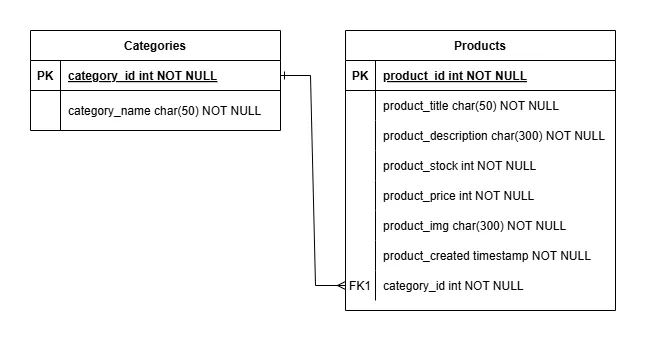

## API-development-assignment-1


#  Webshop API


A RESTful API for managing categories and products in a simple webshop system. Built with **Node.js**, **Express**, and **MySQL**, this API supports full CRUD operations for both categories and products.

##  Features

- CRUD operations for **Categories**
- CRUD operations for **Products**
- Products are related to Categories via `category_id`
- Filter products by category via: `GET /categories/:id/products`
- MySQL database integration using `mysql2/promise`
- Input validation and error handling
- Environment-based configuration

---

### 3NF ER-Diagram



---
##  Getting Started

###  Prerequisites

- Node.js (v18+)
- MySQL
- `npm` or `yarn`

---


### ⚙️ Environment Setup

Create a `.env` file in the root of your project with the following:

```env
DB_HOST=localhost
DB_USER=root
DB_PASSWORD=""
DB_NAME=webshop
DB_PORT=3306
```

---

###  Running the Server
```
npm install
npm run dev
```
This will start the development server on:
http://localhost:3000

## Testing the API

* Insomnia

* Postman

---

###  API Endpoints
### 🔹 Categories
| Method | Endpoint                   | Description                    |
| ------ | -------------------------- | ------------------------------ |
| GET    | `/categories`              | Get all categories             |
| GET    | `/categories/:id`          | Get a specific category        |
| POST   | `/categories`              | Create a new category          |
| PATCH  | `/categories/:id`          | Update a category              |
| DELETE | `/categories/:id`          | Delete a category              |
| GET    | `/categories/:id/products` | Get all products in a category |
### 🔹 Products
| Method | Endpoint                   | Description                    |
| ------ | -------------------------- | ------------------------------ |
| GET    | `/categories`              | Get all categories             |
| GET    | `/categories/:id`          | Get a specific category        |
| POST   | `/categories`              | Create a new category          |
| PATCH  | `/categories/:id`          | Update a category              |
| DELETE | `/categories/:id`          | Delete a category              |
| GET    | `/categories/:id/products` | Get all products in a category |
---
### Author
#### Developed by Emelie Boss - Student project for Medieinstututet 2025
